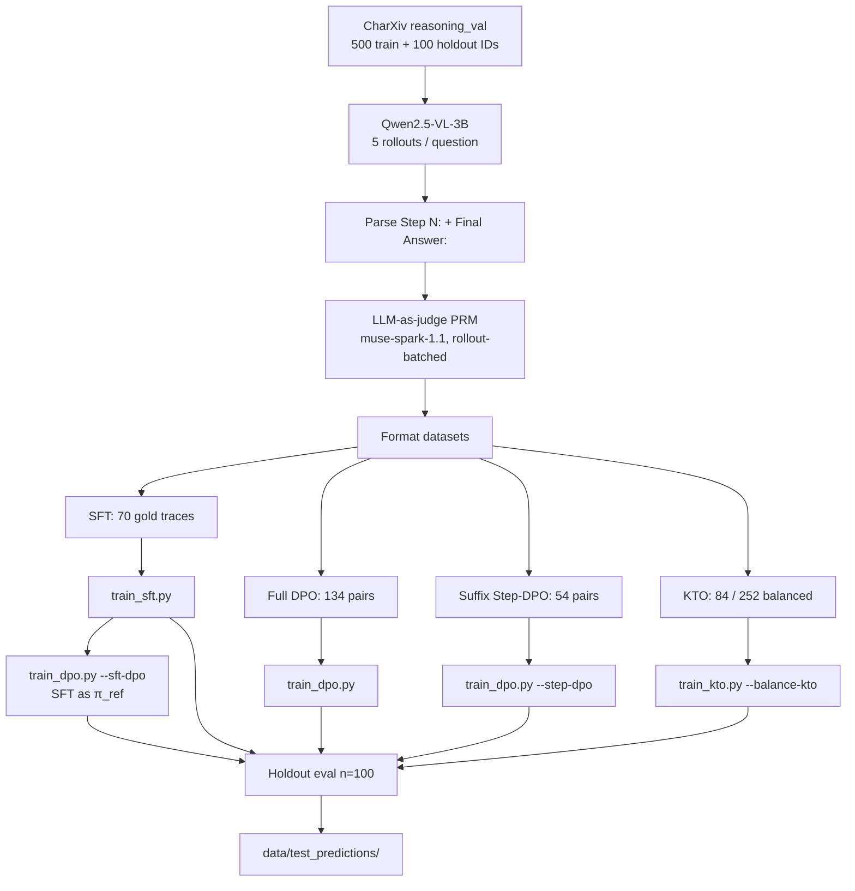

# ChartPRM

[](https://www.python.org/downloads/)
[](#development)
[](#hardware)
[](https://charxiv.github.io/)

**Alignment methods for multimodal chart reasoning under strict academic compute.**

ChartPRM studies whether process-level supervision and preference alignment can improve *chart question answering* when the generator is a small vision-language model. Starting from Qwen2.5-VL-3B-Instruct, we generate explicit `Step N:` / `Final Answer:` traces on a balanced 500-question CharXiv reasoning subset, score those traces with an LLM-as-a-judge PRM, and train **SFT**, **full-trajectory DPO**, **suffix Step-DPO**, **KTO**, and **sequential SFT→DPO**. All training and holdout evaluation fit on Kaggle (2×T4 or 1×P100).

> Descriptive CharXiv questions are out of scope. We use 500 stratified reasoning questions for training data and a disjoint 100-question holdout for evaluation.

---

## Abstract

Process Reward Models (PRMs) are typically trained at a scale we cannot reproduce. This repository instead asks a narrower, compute-honest question: **given a 3B chart VLM, a 500-example reasoning pool, and a PRM-style judge, which lightweight alignment recipe actually helps?**

We compare six systems on 100 held-out CharXiv reasoning questions. Full-trajectory DPO from Instruct is the only method that beats the base model on official exact-match (**29% vs 26%**). SFT maximises format adherence (`Step 1:` on 100% of traces) but drops accuracy. Suffix Step-DPO restores `Final Answer:` after fragment-training collapse but does not lift exact-match. Balanced KTO ties the base model while largely abandoning the step template. Canonical SFT→DPO keeps SFT's format and is the *worst* exact-match system (**22%**), with the highest wrong-committed-answer rate (**53%**).

**Takeaway:** under this budget, preference alignment on full correct/incorrect traces helps more than format cloning or stacking SFT then DPO. Exact-match also hides models that are right in prose (KTO) or right with extra units (SFT `S = 25`).

---

## Holdout Benchmark (n = 100 reasoning questions)

Official exact-match is whitespace + lowercase equality on the extracted `Final Answer:`. Token match allows light normalisation (markdown, unicode, short units/labels). **Wrong committed** is a hallucination *proxy*: the extracted answer is wrong *and* the ground truth never appears in the full trace.

| System | Official EM | Token match | Extracted-answer | Starts `Step 1:` | Structure score | Wrong committed | GT in full text |
| :--- | ---: | ---: | ---: | ---: | ---: | ---: | ---: |
| Base (Instruct) | 26% | 28% | 100% | 93% | 97% | 37% | 63% |
| SFT | 23% | 28% | 100% | **100%** | **100%** | 43% | 57% |
| **Full DPO (Instruct→DPO)** | **29%** | **30%** | 100% | 95% | 97% | 49% | 51% |
| Suffix Step-DPO | 25% | 25% | 99% | 42% | 68% | 36% | 64% |
| KTO v14 | 26% | 29% | 90% | 0% | 21% | **30%** | **66%** |
| SFT→DPO | 22% | 25% | 100% | **100%** | 98% | 53% | 47% |

Frozen run artifacts: [`experiments/007_sft_dpo_holdout/`](experiments/007_sft_dpo_holdout/) (merged onto experiment 005). Quality write-up: [`quality_metrics.md`](experiments/007_sft_dpo_holdout/quality_metrics.md).

### Raw predictions (all six models)

Holdout generations, extracted answers, exact-match flags, and ground truths are exported under [`data/test_predictions/`](data/test_predictions/):

| File | Contents |
| :--- | :--- |
| [`all_models_test_answers.jsonl`](data/test_predictions/all_models_test_answers.jsonl) | One row per question, all six systems |
| [`all_models_test_answers.csv`](data/test_predictions/all_models_test_answers.csv) | Spreadsheet view of the same table |
| [`by_model/*.jsonl`](data/test_predictions/by_model/) | Isolated traces: `base`, `sft`, `dpo`, `step_dpo`, `kto`, `sft_dpo` |

---

## Key Findings

1. **Preference on full trajectories beats format cloning.** Instruct→DPO is the only system above base exact-match. SFT is a perfect format clone and a worse answerer.
2. **SFT→DPO does not compose the two strengths.** It inherits SFT's `Step 1:` rate (100%) and loses both SFT's 23% and DPO's 29%, while committing a wrong final value (GT never mentioned) on 53% of questions.
3. **Step-DPO on single-step fragments taught the model to stop.** Suffix-from-divergence targets restored `Final Answer:` (90% → 99%) but exact-match stayed at 25%. Prefix masking alone is not a substitute for full-trace preference.
4. **KTO is the format anarchist and the least overconfident.** `Step 1:` rate is 0%; conversational preamble is 99%. It mentions the ground truth most often (66%) and has the lowest wrong-committed proxy (30%), but 0% of its correct answers are structured. Official EM therefore under-credits KTO markdown answers (`** Reverse` vs `Reverse`).
5. **Exact-match is a harsh, incomplete metric.** SFT has a 5 pp “correct, not exact” gap (`S = 25`, unicode dots). Always inspect [`data/test_predictions/`](data/test_predictions/) before claiming a method failed.
6. **The PRM judge also works as an inference-time verifier**, not just a training-data labeler. Picking the best of several already-generated rollouts by step-pass rate reaches 27.5% accuracy on the 500-question pool, beating both random selection (18.4%) and majority vote (21.0%) — see [`experiments/008_prm_best_of_n/`](experiments/008_prm_best_of_n/).

---

## Pipeline



```text
CharXiv chart + reasoning question
        │
        ▼
Qwen2.5-VL-3B  →  Step 1: … Step k: … Final Answer: <short value>
        │
        ▼
PRM judge scores every step (rollout-batched Meta API)
        │
        ├── SFT on fully correct traces
        ├── Full-trajectory DPO (chosen vs rejected rollout)
        ├── Suffix Step-DPO (loss on first divergent step → FA)
        ├── KTO on desirable / undesirable completions
        └── SFT→DPO (copy SFT LoRA; freeze SFT as reference)
        │
        ▼
Greedy holdout generation  →  exact-match + structure + hallucination proxy
```

---

## Methods (short)

| Method | Data | Loss target | Init / reference | Notes |
| :--- | :--- | :--- | :--- | :--- |
| **SFT** | 70 full correct rollouts | Right-padded completion tokens | Instruct | 1 epoch, `lr=1e-5`, LoRA r=16 / α=32 |
| **Full DPO** | 134 full-trajectory pairs | Chosen vs rejected completion | Instruct (`disable_adapter`) | 1 epoch, `lr=1e-5`, β=0.1 |
| **Suffix Step-DPO** | 54 pairs, suffix from first divergence through `Final Answer:` | Prefix-masked DPO | Instruct | 2 epochs; fragment guard kept on |
| **KTO** | 84 desirable / 252 undesirable (1:3, hard-neg filtered) | Kahneman–Tversky | Instruct | v14: `lr=2e-6`, β=0.1, 2 epochs, warn-only collapse guard |
| **SFT→DPO** | Same 134 DPO pairs | Full-trajectory DPO | SFT LoRA copied into policy; SFT frozen as π_ref | `lr=2e-6`, 1 epoch; does **not** overwrite Instruct→DPO |

Adapter directories are collision-resolved by exact name (`qwen_vl_dpo_adapter` vs `qwen_vl_step_dpo_adapter`). Substring matching previously loaded Step-DPO for both DPO slots (experiment 004).

---

## Repository Layout

```text
chart-prm/
├── adapters/                      # LoRA checkpoints (gitignored)
├── data/
│   ├── CharXiv/                   # Official JSON + subset images
│   ├── splits/                    # 500 train IDs + 100 holdout IDs
│   └── test_predictions/          # 6-model holdout answers
├── experiments/                   # Frozen runs 001–007
├── logs/                          # Training logs (gitignored)
├── notebooks/                     # Interactive analysis
├── scripts/
│   ├── data_prep/                 # Sampling, images, SFT/DPO/KTO formatters
│   ├── train/                     # train_sft.py, train_dpo.py, train_kto.py
│   ├── evaluation/                # PRM judge, holdout quality, merge
│   ├── tools/                     # Style example, SFT→DPO preflight
│   └── kaggle/                    # Kernel notebooks + metadata
├── src/chart_prm/                 # Trainers, guards, metrics, adapter resolve
├── src/visualization/             # NeurIPS/ICML plotting style
├── tests/                         # 49 unit tests
├── implementation_log.md
└── README.md
```

Run all CLI scripts from the **repository root** so relative `data/` and `experiments/` paths resolve.

---

## Reproduction

### Environment

```bash
uv sync
uv run pytest          # 49 tests
```

Do not edit `pyproject.toml` or `uv.lock` by hand. Add packages with `uv add <package>`.

### 1. Data

```bash
uv run python scripts/data_prep/sample_questions.py
uv run python scripts/data_prep/download_images.py
uv run python scripts/data_prep/clean_dataset.py
uv run python scripts/data_prep/fix_jsonl_ids.py
```

IDs: [`data/splits/main_reasoning_ids.json`](data/splits/main_reasoning_ids.json) (500) and [`eval_reasoning_ids.json`](data/splits/eval_reasoning_ids.json) (100).

### 2. PRM judge (optional; evaluated rollouts are already in experiment 001)

```bash
uv run python scripts/evaluation/evaluate_rollouts_meta.py
```

Requires `MODEL_API_KEY` in `.env`.

### 3. Format training sets

```bash
uv run python scripts/data_prep/format_sft.py
uv run python scripts/data_prep/format_full_dpo.py
uv run python scripts/data_prep/format_step_dpo.py
uv run python scripts/data_prep/format_kto.py
```

Outputs live in `experiments/001_500_reasoning/data/`.

### 4. Train (Kaggle 2×T4 or P100; batch size 1)

```bash
# SFT
PYTHONPATH=src python scripts/train/train_sft.py \
  --dataset-path experiments/001_500_reasoning/data/sft_samples.jsonl \
  --output-dir adapters/qwen_vl_sft_adapter --epochs 1 --lr 1e-5 --load-in-4bit

# Full-trajectory DPO (Instruct → DPO)
PYTHONPATH=src python scripts/train/train_dpo.py \
  --dataset-path experiments/001_500_reasoning/data/dpo_pairs.jsonl \
  --output-dir adapters/qwen_vl_dpo_adapter --epochs 1 --load-in-4bit

# Suffix Step-DPO
PYTHONPATH=src python scripts/train/train_dpo.py --step-dpo --load-in-4bit

# KTO (balanced)
PYTHONPATH=src python scripts/train/train_kto.py \
  --balance-kto --auto-desirable-weight --collapse-guard-warn-only \
  --lr 2e-6 --epochs 2 --load-in-4bit

# SFT → DPO (does not overwrite Instruct→DPO)
PYTHONPATH=src python scripts/tools/verify_sft_dpo.py
PYTHONPATH=src python scripts/train/train_dpo.py --sft-dpo \
  --init-adapter adapters/qwen_vl_sft_adapter \
  --collapse-guard-warn-only --max-logp-drop 70 --load-in-4bit
```

Remote kernels: `scripts/kaggle/kaggle_train_{sft,dpo,step_dpo,kto,sft_dpo}/` and `scripts/kaggle/kaggle_eval_holdout/`. Push with `kaggle kernels push -p <dir>`.

### 5. Holdout quality (no GPU)

```bash
uv run python scripts/evaluation/analyze_holdout_quality.py \
  --generations experiments/007_sft_dpo_holdout/data/holdout_generations.jsonl \
  --out-dir experiments/007_sft_dpo_holdout
```

---

## Hardware

| Setting | Device | Precision | Batch |
| :--- | :--- | :--- | :--- |
| Kaggle preferred | 2× T4 | fp16 + LoRA, SDPA, frozen vision encoder | 1 |
| Kaggle fallback | 1× Tesla P100 (sm_60) | Pin `torch==2.5.1+cu124`; kernels include a `--no-deps` + cuDNN fallback | 1 |

Collapse guards abort (or warn) if policy log-prob falls ~40–70 nats below the reference on a chosen/desirable sample. That is how we avoid saving a silent mode-collapse adapter after a single long outlier.

---

## Experiments

| Dir | What is frozen there |
| :--- | :--- |
| [`001_500_reasoning`](experiments/001_500_reasoning/) | 5 rollouts × 500, cleaned traces, PRM scores, formatted SFT/DPO/KTO jsonl |
| [`002_holdout_eval`](experiments/002_holdout_eval/) | First holdout (fragment-trained adapters; collapsed) |
| [`003_holdout_eval_full_traj`](experiments/003_holdout_eval_full_traj/) | Full-trajectory retrain: Base 26 / SFT 23 / DPO 29 / KTO 16 |
| [`004_holdout_eval_step_dpo_kto_v12`](experiments/004_holdout_eval_step_dpo_kto_v12/) | Adapter-collision run (DPO path == Step-DPO); not comparable |
| [`005_holdout_eval_suffix_step_dpo`](experiments/005_holdout_eval_suffix_step_dpo/) | Valid 5-way: Base 26 / SFT 23 / DPO 29 / Step-DPO 25 / KTO 26 |
| [`006_sft_then_dpo`](experiments/006_sft_then_dpo/) | SFT→DPO training (134/134 steps, pref acc 97.8%) |
| [`007_sft_dpo_holdout`](experiments/007_sft_dpo_holdout/) | Six-system holdout used in the table above |
| [`008_prm_best_of_n`](experiments/008_prm_best_of_n/) | PRM used as an inference-time verifier (not a training label): best-of-N over existing rollouts vs. random / majority vote / oracle |

---

## Resources

| | |
| :--- | :--- |
| **Dataset** | [CharXiv](https://charxiv.github.io/) · [princeton-nlp/CharXiv](https://huggingface.co/datasets/princeton-nlp/CharXiv) |
| **Generator** | [Qwen/Qwen2.5-VL-3B-Instruct](https://huggingface.co/Qwen/Qwen2.5-VL-3B-Instruct) |
| **PRM judge** | Meta `muse-spark-1.1` (rollout-batched, images resized to 512 px) |

---

## Development

- **Tests:** `uv run pytest` — 49 unit tests covering DPO/SFT/KTO losses, prefix masking, data guards, adapter resolve, holdout merge/metrics, and the step-DPO formatter.
- **Logging:** every implementation step is recorded in [`implementation_log.md`](implementation_log.md).
- **Agents:** see `agents/instructions.md` and `.cursorrules`. Compute and dataset constraints in those files are binding.
- **Git:** adapters and logs are gitignored; experiment metrics and `data/test_predictions/` are tracked.
