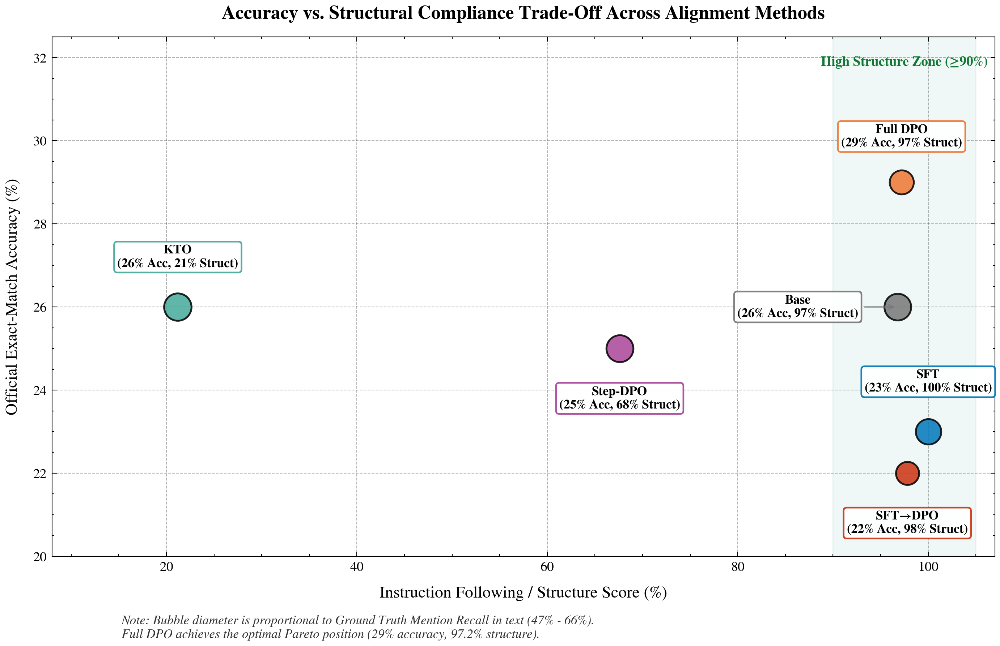
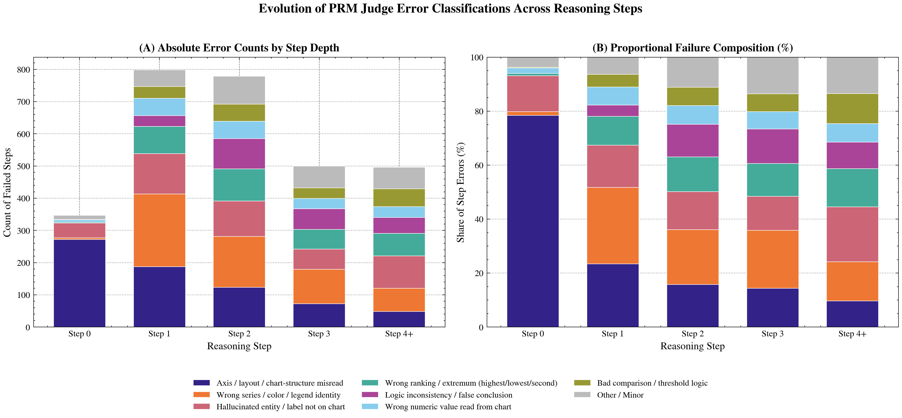
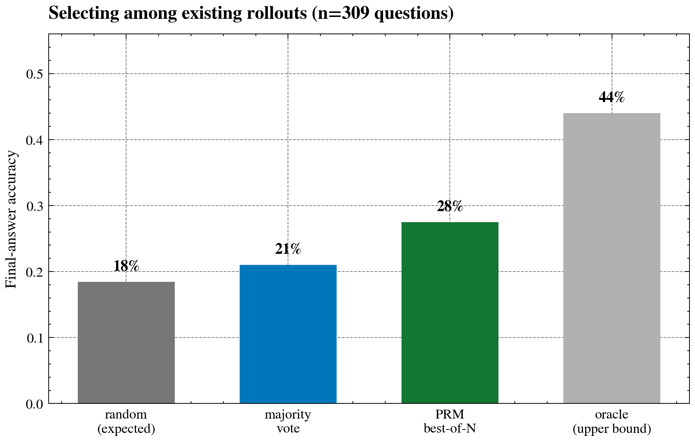
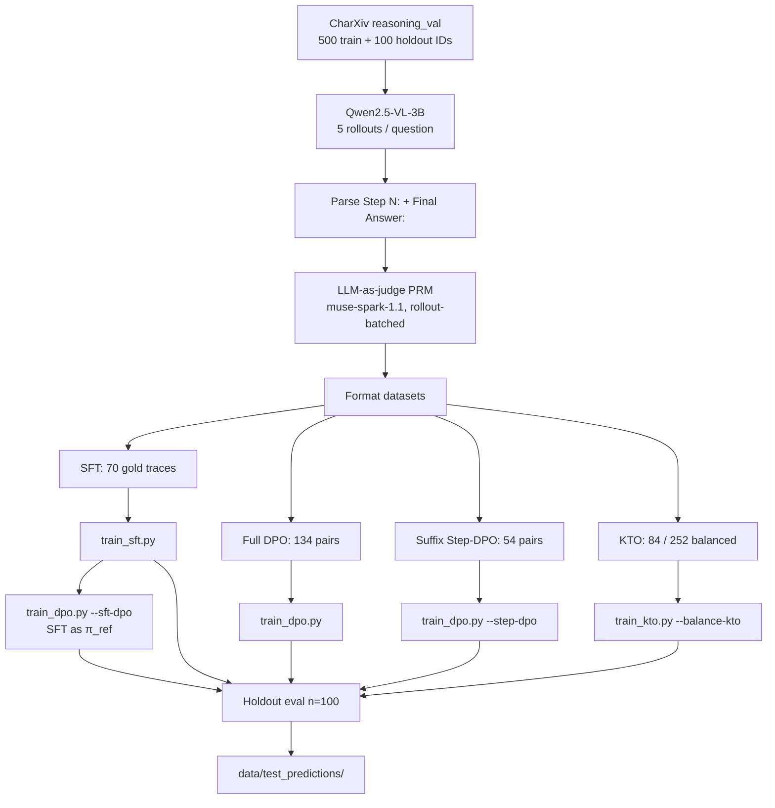

# ChartPRM: Process Supervision & Preference Alignment for Chart Reasoning

**Can a compact vision-language model reason through complex scientific charts when aligned with only a handful of examples?**

<p align="center">
  <br/>
  <em><b>1. Accuracy vs. Structure Pareto Frontier:</b> Full DPO (29.0% EM) achieves the sweet spot. SFT enforces 100% format compliance but drops accuracy to 23.0%, while KTO captures the correct answer in text 66.0% of the time but collapses structurally.</em>
</p>

<p align="center">
  <br/>
  <em><b>2. Error Mode Composition by Step Depth:</b> Failures are perceptual rather than logical. Step 0 is dominated by axis misreads (78.5%), acting as poisoned premises that cause cascading downstream errors in 82.7% of cases.</em>
</p>

<p align="center">
  <br/>
  <em><b>3. Test-Time PRM Verifier Search:</b> Scoring candidate rollouts with the step PRM reaches 27.5% accuracy across 309 multi-candidate questions, outperforming majority voting (21.0%) and random rollout selection (18.4%).</em>
</p>


---

## What is this project?

Most work on Process Reward Models (PRMs) relies on massive compute clusters and tens of thousands of annotations. We wanted to see what happens on the opposite end of the spectrum:

> **If you only have a compact 3B vision model, a single consumer GPU, and fewer than 150 training pairs, can step-by-step process supervision still teach the model to reason?**

We benchmarked **Qwen2.5-VL-3B-Instruct** on 500 challenging reasoning questions from the **CharXiv** benchmark (scientific charts from arXiv papers across 8 disciplines). We generated multi-step reasoning rollouts (`Step 1:`, `Step 2:`, ..., `Final Answer:`), graded every intermediate step with a vision LLM judge (`muse-spark-1.1`), and trained five lightweight alignment recipes on Kaggle (T4/P100 GPUs):
- **SFT**: Supervised fine-tuning on 70 verified, flawless reasoning traces.
- **Full DPO**: Pairwise Direct Preference Optimization on 134 chosen vs. rejected rollouts.
- **Step-DPO**: Preference loss applied only to the suffix starting at the exact step where reasoning diverged (54 pairs).
- **KTO**: Unpaired prospect-theoretic alignment (84 desirable vs. 252 undesirable completions).
- **SFT → DPO**: Standard two-stage pipeline (warm up with SFT, then run DPO).

---

## Main Results (100-question held-out test set)

We evaluated all models on 100 held-out CharXiv reasoning charts that were never seen during training or prompt exploration.

| System | Official EM | Token Match | Valid Format | Starts `Step 1:` | Structure Score | Wrong Committed | GT Mentioned in Text |
| :--- | :---: | :---: | :---: | :---: | :---: | :---: | :---: |
| Base (`Qwen2.5-VL-3B`) | 26% | 28% | 100% | 93% | 97% | 37% | 63% |
| SFT (70 traces) | 23% | 28% | 100% | **100%** | **100%** | 43% | 57% |
| **Full DPO (134 pairs)** | **29%** | **30%** | 100% | 95% | 97% | 49% | 51% |
| Suffix Step-DPO (54 pairs) | 25% | 25% | 99% | 42% | 68% | 36% | 64% |
| KTO (84 / 252 rollouts) | 26% | 29% | 90% | 0% | 21% | **30%** | **66%** |
| SFT → DPO | 22% | 25% | 100% | **100%** | 98% | 53% | 47% |

* **Official EM**: Exact match on extracted `Final Answer:` (case- and whitespace-normalized).
* **Token Match**: Flexible token match accounting for units or punctuation.
* **Wrong Committed**: The model outputs a wrong answer and *never* mentions the true value anywhere in its reasoning (a proxy for confident hallucination).
* **GT Mentioned in Text**: Whether the correct answer appears anywhere in the model's intermediate thoughts, even if not extracted under `Final Answer:`.

All raw model outputs, extracted answers, and score evaluations are available in [`data/test_predictions/`](data/test_predictions/).

---

## What We Learned

1. **Full DPO worked best (and confirmed our small-data hypothesis):** Training on just 134 preference pairs lifted exact-match accuracy from 26% to **29%** (+3.0 pp). Contrastive negative signal helped the model avoid deceptive visual traps without breaking its ability to follow the step format.
2. **SFT suffered from formatting rigidity (23% accuracy):** Training on 70 gold traces produced a model with **100% perfect formatting**, but accuracy dropped 3 points below the base model. Without negative examples showing what *not* to do, SFT overfit to output structure rather than improving visual reasoning.
3. **KTO knew the answers but forgot how to answer (the structure-accuracy trade-off):** KTO mentioned the correct answer in text **66% of the time** (higher than any other model) and had the lowest confident hallucination rate (30%). However, because it was trained on unpaired data without reference comparisons, it completely lost the step-by-step formatting (0% started with `Step 1:`). It rambled conversationally, meaning official exact-match under-counted its true capabilities.
4. **Sequential SFT → DPO failed completely (22% accuracy):** In NLP, standard practice is to run SFT before RLHF/DPO. In our small-data regime, SFT biased the reference policy into rigid templates, causing subsequent DPO to commit to wrong answers on 53% of test questions. Training DPO directly from the base Instruct checkpoint performed much better.
5. **Why chart reasoning fails: bad vision, not bad math:** Analyzing 2,920 failed steps showed that **43.5% of errors were purely visual** (axis misreads at 24.0% and series/legend confusion at 19.5%), while **only 1.3% were arithmetic mistakes**. Errors also cascade immediately: 79.7% of first mistakes happened in Steps 0–1, and an erroneous step led to downstream failure in **82.7%** of cases.
6. **The PRM judge makes a strong test-time verifier:** Selecting candidate answers by average step score reached **27.5% accuracy**, beating both uniform random selection (18.4%) and majority voting (21.0%).

---

## Pipeline



```text
CharXiv chart + reasoning question
        │
        ▼
Qwen2.5-VL-3B  →  Step 1: … Step k: … Final Answer: <short value>
        │
        ▼
PRM judge scores every step (rollout-batched Meta API)
        │
        ├── SFT on fully correct traces
        ├── Full-trajectory DPO (chosen vs rejected rollout)
        ├── Suffix Step-DPO (loss on first divergent step → FA)
        ├── KTO on desirable / undesirable completions
        └── SFT→DPO (copy SFT LoRA; freeze SFT as reference)
        │
        ▼
Greedy holdout generation  →  exact-match + structure + hallucination proxy
```

---

## Methods (short)

| Method | Data | Loss target | Init / reference | Notes |
| :--- | :--- | :--- | :--- | :--- |
| **SFT** | 70 full correct rollouts | Right-padded completion tokens | Instruct | 1 epoch, `lr=1e-5`, LoRA r=16 / α=32 |
| **Full DPO** | 134 full-trajectory pairs | Chosen vs rejected completion | Instruct (`disable_adapter`) | 1 epoch, `lr=1e-5`, β=0.1 |
| **Suffix Step-DPO** | 54 pairs, suffix from first divergence through `Final Answer:` | Prefix-masked DPO | Instruct | 2 epochs; fragment guard kept on |
| **KTO** | 84 desirable / 252 undesirable (1:3, hard-neg filtered) | Kahneman–Tversky | Instruct | v14: `lr=2e-6`, β=0.1, 2 epochs, warn-only collapse guard |
| **SFT→DPO** | Same 134 DPO pairs | Full-trajectory DPO | SFT LoRA copied into policy; SFT frozen as π_ref | `lr=2e-6`, 1 epoch; does **not** overwrite Instruct→DPO |

Adapter directories are collision-resolved by exact name (`qwen_vl_dpo_adapter` vs `qwen_vl_step_dpo_adapter`). Substring matching previously loaded Step-DPO for both DPO slots (experiment 004).

---

## Repository Layout

```text
chart-prm/
├── adapters/                      # LoRA checkpoints (gitignored)
├── data/
│   ├── CharXiv/                   # Official JSON + subset images
│   ├── splits/                    # 500 train IDs + 100 holdout IDs
│   └── test_predictions/          # 6-model holdout answers
├── experiments/                   # Frozen runs 001–007
├── logs/                          # Training logs (gitignored)
├── notebooks/                     # Interactive analysis
├── scripts/
│   ├── data_prep/                 # Sampling, images, SFT/DPO/KTO formatters
│   ├── train/                     # train_sft.py, train_dpo.py, train_kto.py
│   ├── evaluation/                # PRM judge, holdout quality, merge
│   ├── tools/                     # Style example, SFT→DPO preflight
│   └── kaggle/                    # Kernel notebooks + metadata
├── src/chart_prm/                 # Trainers, guards, metrics, adapter resolve
├── src/visualization/             # NeurIPS/ICML plotting style
├── tests/                         # 49 unit tests
├── implementation_log.md
└── README.md
```

Run all CLI scripts from the **repository root** so relative `data/` and `experiments/` paths resolve.

---

## Reproduction

### Environment

```bash
uv sync
uv run pytest          # 49 tests
```

Do not edit `pyproject.toml` or `uv.lock` by hand. Add packages with `uv add <package>`.

### 1. Data

```bash
uv run python scripts/data_prep/sample_questions.py
uv run python scripts/data_prep/download_images.py
uv run python scripts/data_prep/clean_dataset.py
uv run python scripts/data_prep/fix_jsonl_ids.py
```

IDs: [`data/splits/main_reasoning_ids.json`](data/splits/main_reasoning_ids.json) (500) and [`eval_reasoning_ids.json`](data/splits/eval_reasoning_ids.json) (100).

### 2. PRM judge (optional; evaluated rollouts are already in experiment 001)

```bash
uv run python scripts/evaluation/evaluate_rollouts_meta.py
```

Requires `MODEL_API_KEY` in `.env`.

### 3. Format training sets

```bash
uv run python scripts/data_prep/format_sft.py
uv run python scripts/data_prep/format_full_dpo.py
uv run python scripts/data_prep/format_step_dpo.py
uv run python scripts/data_prep/format_kto.py
```

Outputs live in `experiments/001_500_reasoning/data/`.

### 4. Train (Kaggle 2×T4 or P100; batch size 1)

```bash
# SFT
PYTHONPATH=src python scripts/train/train_sft.py \
  --dataset-path experiments/001_500_reasoning/data/sft_samples.jsonl \
  --output-dir adapters/qwen_vl_sft_adapter --epochs 1 --lr 1e-5 --load-in-4bit

# Full-trajectory DPO (Instruct → DPO)
PYTHONPATH=src python scripts/train/train_dpo.py \
  --dataset-path experiments/001_500_reasoning/data/dpo_pairs.jsonl \
  --output-dir adapters/qwen_vl_dpo_adapter --epochs 1 --load-in-4bit

# Suffix Step-DPO
PYTHONPATH=src python scripts/train/train_dpo.py --step-dpo --load-in-4bit

# KTO (balanced)
PYTHONPATH=src python scripts/train/train_kto.py \
  --balance-kto --auto-desirable-weight --collapse-guard-warn-only \
  --lr 2e-6 --epochs 2 --load-in-4bit

# SFT → DPO (does not overwrite Instruct→DPO)
PYTHONPATH=src python scripts/tools/verify_sft_dpo.py
PYTHONPATH=src python scripts/train/train_dpo.py --sft-dpo \
  --init-adapter adapters/qwen_vl_sft_adapter \
  --collapse-guard-warn-only --max-logp-drop 70 --load-in-4bit
```

Remote kernels: `scripts/kaggle/kaggle_train_{sft,dpo,step_dpo,kto,sft_dpo}/` and `scripts/kaggle/kaggle_eval_holdout/`. Push with `kaggle kernels push -p <dir>`.

### 5. Holdout quality (no GPU)

```bash
uv run python scripts/evaluation/analyze_holdout_quality.py \
  --generations experiments/007_sft_dpo_holdout/data/holdout_generations.jsonl \
  --out-dir experiments/007_sft_dpo_holdout
```

---

## Hardware

| Setting | Device | Precision | Batch |
| :--- | :--- | :--- | :--- |
| Kaggle preferred | 2× T4 | fp16 + LoRA, SDPA, frozen vision encoder | 1 |
| Kaggle fallback | 1× Tesla P100 (sm_60) | Pin `torch==2.5.1+cu124`; kernels include a `--no-deps` + cuDNN fallback | 1 |

Collapse guards abort (or warn) if policy log-prob falls ~40–70 nats below the reference on a chosen/desirable sample. That is how we avoid saving a silent mode-collapse adapter after a single long outlier.

---

## Experiments

| Dir | What is frozen there |
| :--- | :--- |
| [`001_500_reasoning`](experiments/001_500_reasoning/) | 5 rollouts × 500, cleaned traces, PRM scores, formatted SFT/DPO/KTO jsonl |
| [`002_holdout_eval`](experiments/002_holdout_eval/) | First holdout (fragment-trained adapters; collapsed) |
| [`003_holdout_eval_full_traj`](experiments/003_holdout_eval_full_traj/) | Full-trajectory retrain: Base 26 / SFT 23 / DPO 29 / KTO 16 |
| [`004_holdout_eval_step_dpo_kto_v12`](experiments/004_holdout_eval_step_dpo_kto_v12/) | Adapter-collision run (DPO path == Step-DPO); not comparable |
| [`005_holdout_eval_suffix_step_dpo`](experiments/005_holdout_eval_suffix_step_dpo/) | Valid 5-way: Base 26 / SFT 23 / DPO 29 / Step-DPO 25 / KTO 26 |
| [`006_sft_then_dpo`](experiments/006_sft_then_dpo/) | SFT→DPO training (134/134 steps, pref acc 97.8%) |
| [`007_sft_dpo_holdout`](experiments/007_sft_dpo_holdout/) | Six-system holdout used in the table above |
| [`008_prm_best_of_n`](experiments/008_prm_best_of_n/) | PRM used as an inference-time verifier (not a training label): best-of-N over existing rollouts vs. random / majority vote / oracle |

---

## Resources

| | |
| :--- | :--- |
| **Dataset** | [CharXiv](https://charxiv.github.io/) · [princeton-nlp/CharXiv](https://huggingface.co/datasets/princeton-nlp/CharXiv) |
| **Generator** | [Qwen/Qwen2.5-VL-3B-Instruct](https://huggingface.co/Qwen/Qwen2.5-VL-3B-Instruct) |
| **PRM judge** | Meta `muse-spark-1.1` (rollout-batched, images resized to 512 px) |

---

## Development

- **Tests:** `uv run pytest` — 49 unit tests covering DPO/SFT/KTO losses, prefix masking, data guards, adapter resolve, holdout merge/metrics, and the step-DPO formatter.
- **Logging:** every implementation step is recorded in [`implementation_log.md`](implementation_log.md).
- **Agents:** see `agents/instructions.md` and `.cursorrules`. Compute and dataset constraints in those files are binding.
- **Git:** adapters and logs are gitignored; experiment metrics and `data/test_predictions/` are tracked.
