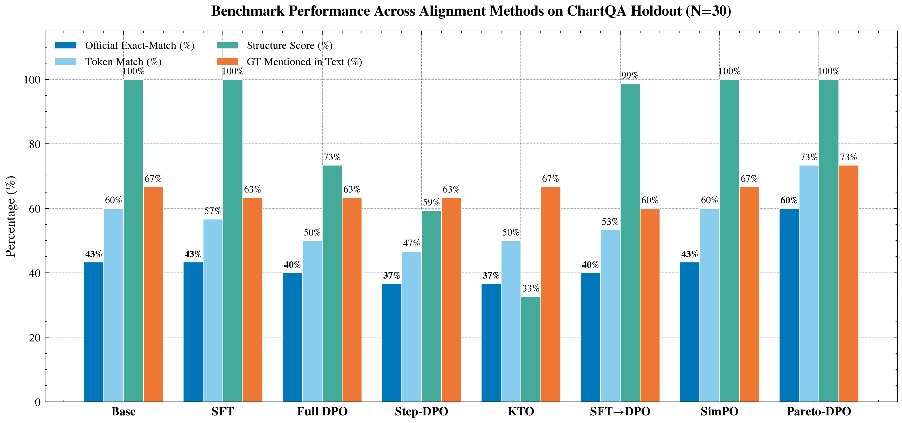
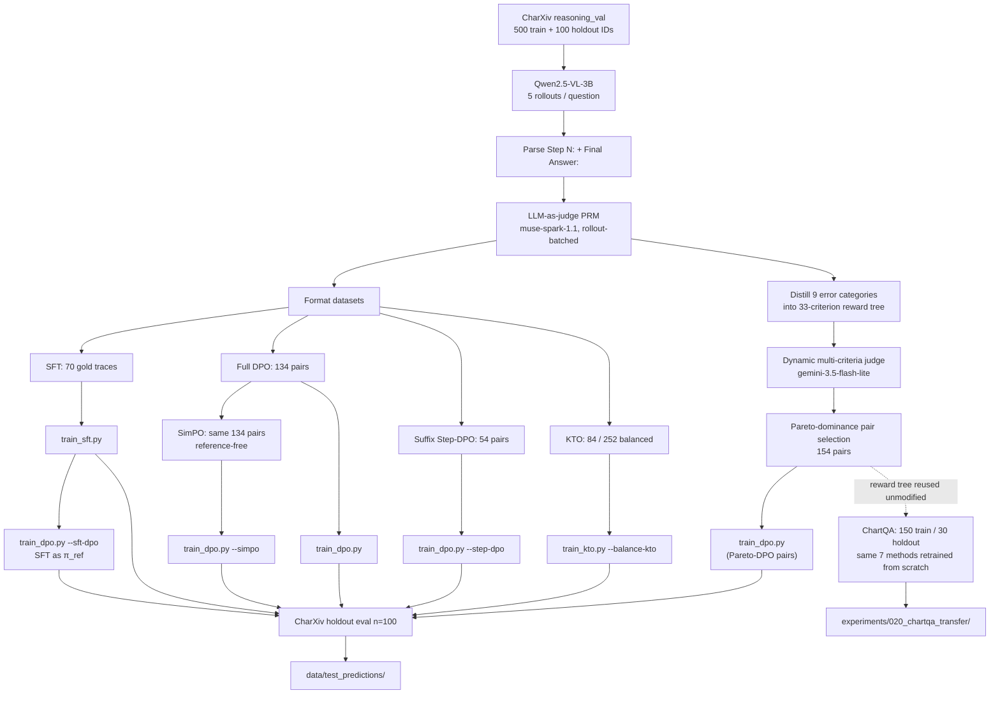

# ChartPRM: Process Supervision & Preference Alignment for Chart Reasoning

**Can a compact vision-language model reason through complex scientific charts when aligned with only a handful of examples?**

<p align="center">
  <br/>
  <em><b>1. Accuracy vs. Structure Pareto Frontier (original 5-method sweep):</b> Full DPO (29.0% EM) is the best balance among these five. SFT enforces 100% format compliance but drops accuracy to 23.0%, while KTO captures the correct answer in text 66.0% of the time but collapses structurally. Pareto-DPO, added later (see below), surpasses all five at 30.0% EM with 97.0% structure.</em>
</p>

<p align="center">
  <br/>
  <em><b>2. Error Mode Composition by Step Depth:</b> Failures are perceptual rather than logical. Step 0 is dominated by axis misreads (78.5%), acting as poisoned premises that cause cascading downstream errors in 82.7% of cases.</em>
</p>

<p align="center">
  <br/>
  <em><b>3. Test-Time PRM Verifier Search:</b> Scoring candidate rollouts with the step PRM reaches 27.5% accuracy across 309 multi-candidate questions, outperforming majority voting (21.0%) and random rollout selection (18.4%).</em>
</p>

<p align="center">
  <br/>
  <em><b>4. Cross-Dataset Transfer to ChartQA (N=30 holdout):</b> The reward tree and Pareto-dominance pair selection, built entirely on CharXiv, transfer unmodified to a second benchmark. Pareto-DPO reaches 60.0% exact-match against a 43.3% base, +16.7 pp, the largest margin of any method on either dataset.</em>
</p>


---

## What is this project?

Most work on Process Reward Models (PRMs) relies on massive compute clusters and tens of thousands of annotations. We wanted to see what happens on the opposite end of the spectrum:

> **If you only have a compact 3B vision model, a single consumer GPU, and fewer than 150 training pairs, can step-by-step process supervision still teach the model to reason?**

We benchmarked **Qwen2.5-VL-3B-Instruct** on 500 challenging reasoning questions from the **CharXiv** benchmark (scientific charts from arXiv papers across 8 disciplines). We generated multi-step reasoning rollouts (`Step 1:`, `Step 2:`, ..., `Final Answer:`), graded every intermediate step with a vision LLM judge (`muse-spark-1.1`), and trained seven lightweight alignment recipes on Kaggle (T4/P100 GPUs):
- **SFT**: Supervised fine-tuning on 70 verified, flawless reasoning traces.
- **Full DPO**: Pairwise Direct Preference Optimization on 134 chosen vs. rejected rollouts.
- **Step-DPO**: Preference loss applied only to the suffix starting at the exact step where reasoning diverged (54 pairs).
- **KTO**: Unpaired prospect-theoretic alignment (84 desirable vs. 252 undesirable completions).
- **SFT → DPO**: Standard two-stage pipeline (warm up with SFT, then run DPO).
- **SimPO**: Reference-free preference optimization on the same 134 pairs as Full DPO, no `π_ref` forward pass.
- **Pareto-DPO**: Instead of a single binary pass/fail score per step, we distill the judge's failure critiques into a **reward tree** of 33 scored criteria under 9 error categories, score every step against all 33 at once, and keep a preference pair only when the chosen rollout Pareto-dominates the rejected one across every criterion simultaneously (154 pairs). Full recipe in [`src/chart_prm/criteria_distillation.py`](src/chart_prm/criteria_distillation.py) and [`scripts/evaluation/build_reward_tree.py`](scripts/evaluation/build_reward_tree.py).

We then asked whether any of this is specific to CharXiv: the entire pipeline, rollout generation, reward-tree scoring, preference curation, and training for all seven methods, was rebuilt from scratch on a second, disjoint benchmark, **ChartQA** (150 training questions, 30 held out), reusing the CharXiv-built reward tree completely unmodified. Pareto-DPO wins there too, by a wider margin than on CharXiv.

---

## Main Results (100-question held-out test set)

We evaluated all models on 100 held-out CharXiv reasoning charts that were never seen during training or prompt exploration.

| System | Official EM | Token Match | Valid Format | Starts `Step 1:` | Structure Score | Wrong Committed | GT Mentioned in Text |
| :--- | :---: | :---: | :---: | :---: | :---: | :---: | :---: |
| Base (`Qwen2.5-VL-3B`) | 26% | 28% | 100% | 93% | 97% | 37% | 63% |
| SFT (70 traces) | 23% | 28% | 100% | **100%** | **100%** | 43% | 57% |
| Full DPO (134 pairs) | 29% | 30% | 100% | 95% | 97% | 49% | 51% |
| Suffix Step-DPO (54 pairs) | 25% | 25% | 99% | 42% | 68% | 36% | 64% |
| KTO (84 / 252 rollouts) | 26% | 29% | 90% | 0% | 21% | **30%** | **66%** |
| SFT → DPO | 22% | 25% | 100% | **100%** | 98% | 53% | 47% |
| SimPO (134 pairs, ref.-free) | 26% | 27% | -- | -- | 95% | 40% | -- |
| **Pareto-DPO (154 pairs, reward-tree filtered)** | **30%** | **31%** | -- | -- | 97% | 46% | -- |

* **Official EM**: Exact match on extracted `Final Answer:` (case- and whitespace-normalized).
* **Token Match**: Flexible token match accounting for units or punctuation.
* **Wrong Committed**: The model outputs a wrong answer and *never* mentions the true value anywhere in its reasoning (a proxy for confident hallucination).
* **GT Mentioned in Text**: Whether the correct answer appears anywhere in the model's intermediate thoughts, even if not extracted under `Final Answer:`. Not computed for SimPO/Pareto-DPO.

Raw outputs for the original six systems are in [`data/test_predictions/`](data/test_predictions/); SimPO's and Pareto-DPO's holdout generations are in [`experiments/017_simpo/`](experiments/017_simpo/) and [`experiments/014_pareto_dpo/`](experiments/014_pareto_dpo/) respectively.

## Cross-Dataset Transfer: ChartQA Holdout (30-question held-out test set)

Same seven methods, same hyperparameters, retrained from scratch on an independently sampled **ChartQA** pool, reusing the CharXiv reward tree unmodified (no retuning, no new criteria).

| System | Official EM | Token Match | Structure Score | Wrong Committed | GT Mentioned in Text |
| :--- | :---: | :---: | :---: | :---: | :---: |
| Base (`Qwen2.5-VL-3B`) | 43.3% | 60.0% | **100.0%** | 33.3% | 66.7% |
| SFT | 43.3% | 56.7% | **100.0%** | 36.7% | 63.3% |
| Full DPO | 40.0% | 50.0% | 73.3% | 33.3% | 63.3% |
| Suffix Step-DPO | 36.7% | 46.7% | 59.3% | 33.3% | 63.3% |
| KTO | 36.7% | 50.0% | 32.7% | **23.3%** | 66.7% |
| SFT → DPO | 40.0% | 53.3% | 98.7% | 40.0% | 60.0% |
| SimPO | 43.3% | 60.0% | **100.0%** | 33.3% | 66.7% |
| **Pareto-DPO** | **60.0%** | **73.3%** | **100.0%** | 26.7% | **73.3%** |

Pareto-DPO leads on every column except Wrong Committed, +16.7 pp over base, the largest gain of any method on either dataset. At $N=30$, this margin should be read with caution: a single question flip moves EM by 3.3 pp. Full pipeline in [`experiments/020_chartqa_transfer/`](experiments/020_chartqa_transfer/).

---

## What We Learned

1. **Full-trajectory preference optimization worked best (and confirmed our small-data hypothesis):** Training on just 134 preference pairs lifted exact-match accuracy from 26% to **29%** with Full DPO (+3.0 pp). Contrastive negative signal helped the model avoid deceptive visual traps without breaking its ability to follow the step format.
2. **Filtering those same pairs by Pareto dominance across a reward tree does even better:** A single binary pass/fail label can't distinguish an axis misread from a hallucinated legend entry. Distilling the judge's failure critiques into 33 scored criteria and keeping a pair only when the chosen rollout dominates the rejected one on every criterion at once pushes CharXiv accuracy to **30%** (154 pairs) — the best result of any of the seven methods.
3. **That reward tree survives a change of dataset:** Reused completely unmodified on ChartQA (no retuning, no new criteria, no new distillation calls), the tree fires just as densely as on CharXiv, and Pareto-DPO wins there too — by a much wider margin (**60% vs. 43.3% base**, +16.7 pp) than on CharXiv itself.
4. **SFT suffered from formatting rigidity (23% accuracy):** Training on 70 gold traces produced a model with **100% perfect formatting**, but accuracy dropped 3 points below the base model. Without negative examples showing what *not* to do, SFT overfit to output structure rather than improving visual reasoning.
5. **KTO knew the answers but forgot how to answer (the structure-accuracy trade-off):** KTO mentioned the correct answer in text **66% of the time** (higher than any other model) and had the lowest confident hallucination rate (30%). However, because it was trained on unpaired data without reference comparisons, it completely lost the step-by-step formatting (0% started with `Step 1:`). It rambled conversationally, meaning official exact-match under-counted its true capabilities.
6. **Sequential SFT → DPO failed completely (22% accuracy):** In NLP, standard practice is to run SFT before RLHF/DPO. In our small-data regime, SFT biased the reference policy into rigid templates, causing subsequent DPO to commit to wrong answers on 53% of test questions. Training DPO directly from the base Instruct checkpoint performed much better.
7. **Why chart reasoning fails: bad vision, not bad math:** Analyzing 2,920 failed steps showed that **43.5% of errors were purely visual** (axis misreads at 24.0% and series/legend confusion at 19.5%), while **only 1.3% were arithmetic mistakes**. Errors also cascade immediately: 79.7% of first mistakes happened in Steps 0–1, and an erroneous step led to downstream failure in **82.7%** of cases.
8. **The PRM judge makes a strong test-time verifier, no training required:** Selecting candidate answers by average step score reached **27.5% accuracy**, beating both uniform random selection (18.4%) and majority voting (21.0%).

---

## Pipeline



```text
CharXiv chart + reasoning question
        │
        ▼
Qwen2.5-VL-3B  →  Step 1: … Step k: … Final Answer: <short value>
        │
        ▼
PRM judge scores every step (rollout-batched Meta API)
        │
        ├── SFT on fully correct traces
        ├── Full-trajectory DPO (chosen vs rejected rollout)
        ├── Suffix Step-DPO (loss on first divergent step → FA)
        ├── KTO on desirable / undesirable completions
        ├── SFT→DPO (copy SFT LoRA; freeze SFT as reference)
        ├── SimPO (same DPO pairs, no reference model)
        └── Pareto-DPO: judge critiques → 33-criterion reward tree
             → 9-dim score vector per step → pair kept only if
               chosen rollout dominates on every criterion (154 pairs)
        │
        ▼
Greedy holdout generation  →  exact-match + structure + hallucination proxy
        │
        ▼
Reward tree reused unmodified on ChartQA (150 train / 30 holdout,
all 7 methods retrained from scratch) → same eval pipeline
```

---

## Methods (short)

| Method | Data | Loss target | Init / reference | Notes |
| :--- | :--- | :--- | :--- | :--- |
| **SFT** | 70 full correct rollouts | Right-padded completion tokens | Instruct | 1 epoch, `lr=1e-5`, LoRA r=16 / α=32 |
| **Full DPO** | 134 full-trajectory pairs | Chosen vs rejected completion | Instruct (`disable_adapter`) | 1 epoch, `lr=1e-5`, β=0.1 |
| **Suffix Step-DPO** | 54 pairs, suffix from first divergence through `Final Answer:` | Prefix-masked DPO | Instruct | 2 epochs; fragment guard kept on |
| **KTO** | 84 desirable / 252 undesirable (1:3, hard-neg filtered) | Kahneman–Tversky | Instruct | v14: `lr=2e-6`, β=0.1, 2 epochs, warn-only collapse guard |
| **SFT→DPO** | Same 134 DPO pairs | Full-trajectory DPO | SFT LoRA copied into policy; SFT frozen as π_ref | `lr=2e-6`, 1 epoch; does **not** overwrite Instruct→DPO |
| **SimPO** | Same 134 full-trajectory pairs | Length-normalized log-prob, no KL term | Instruct (no reference model) | 1 epoch, `lr=1e-6`, β=2.0, γ/β=0.5; half the forward passes of DPO |
| **Pareto-DPO** | 154 pairs kept by 9-dim Pareto dominance over reward-tree criteria | Identical DPO loss to Full DPO | Instruct (`disable_adapter`) | 1 epoch, `lr=1e-5`, β=0.1; pairs built via `gemini-3.5-flash-lite` dynamic judge |

Adapter directories are collision-resolved by exact name (`qwen_vl_dpo_adapter` vs `qwen_vl_step_dpo_adapter`). Substring matching previously loaded Step-DPO for both DPO slots (experiment 004).

**DynamicPRM reward tree:** A single binary pass/fail score per step can't distinguish, say, an axis misread from a hallucinated legend entry. We cluster the judge's 2,920 failure critiques (MiniLM embeddings, $k$-means, cosine-merge threshold 0.14) into 33 rubric criteria under the 9 error categories, then re-score every step against all 33 at once (`gemini-3.5-flash-lite`, 3.85 criteria fire per step on average, 0% empty selections). A preference pair is kept only when the chosen rollout Pareto-dominates the rejected one across every criterion simultaneously — at least as good everywhere, strictly better somewhere. This is what Pareto-DPO trains on. See [`src/chart_prm/criteria_distillation.py`](src/chart_prm/criteria_distillation.py), [`scripts/evaluation/build_reward_tree.py`](scripts/evaluation/build_reward_tree.py), and [`scripts/evaluation/score_steps_dynamic.py`](scripts/evaluation/score_steps_dynamic.py).

---

## Repository Layout

```text
chart-prm/
├── adapters/                      # LoRA checkpoints (gitignored)
├── charts/                        # Generated figures (report_selected/, chartqa/)
├── data/
│   ├── CharXiv/                   # Official JSON + subset images
│   ├── splits/                    # 500 train IDs + 100 holdout IDs
│   └── test_predictions/          # 6-model CharXiv holdout answers (SimPO/Pareto-DPO generations live in experiments/017_simpo/, 014_pareto_dpo/)
├── experiments/                   # Frozen runs 001–020 (CharXiv + DynamicPRM + ChartQA)
├── logs/                          # Training logs (gitignored)
├── notebooks/                     # Interactive analysis
├── report/                        # ACL-format paper (acl_latex.tex/pdf, contribution statement)
├── scripts/
│   ├── data_prep/                 # Sampling, images, SFT/DPO/KTO/SimPO formatters
│   ├── train/                     # train_sft.py, train_dpo.py, train_kto.py
│   ├── evaluation/                # PRM judge, reward tree, dynamic scoring, holdout quality, merge
│   ├── tools/                     # Style example, SFT→DPO preflight
│   └── kaggle/                    # Kernel notebooks + metadata
├── src/chart_prm/                 # Trainers, guards, metrics, adapter resolve, Pareto filtering, criteria distillation
├── src/visualization/             # NeurIPS/ICML plotting style
├── tests/                         # 137 unit tests
├── implementation_log.md
└── README.md
```

Run all CLI scripts from the **repository root** so relative `data/` and `experiments/` paths resolve.

---

## Reproduction

### Environment

```bash
uv sync
uv run pytest          # 137 tests
```

Do not edit `pyproject.toml` or `uv.lock` by hand. Add packages with `uv add <package>`.

### 1. Data

```bash
uv run python scripts/data_prep/sample_questions.py
uv run python scripts/data_prep/download_images.py
uv run python scripts/data_prep/clean_dataset.py
uv run python scripts/data_prep/fix_jsonl_ids.py
```

IDs: [`data/splits/main_reasoning_ids.json`](data/splits/main_reasoning_ids.json) (500) and [`eval_reasoning_ids.json`](data/splits/eval_reasoning_ids.json) (100).

### 2. PRM judge (optional; evaluated rollouts are already in experiment 001)

```bash
uv run python scripts/evaluation/evaluate_rollouts_meta.py
```

Requires `MODEL_API_KEY` in `.env`.

### 3. Format training sets

```bash
uv run python scripts/data_prep/format_sft.py
uv run python scripts/data_prep/format_full_dpo.py
uv run python scripts/data_prep/format_step_dpo.py
uv run python scripts/data_prep/format_kto.py
```

Outputs live in `experiments/001_500_reasoning/data/`.

### 4. Train (Kaggle 2×T4 or P100; batch size 1)

Precision is auto-detected from the GPU (`use_4bit = compute capability >= 7.0`), so no `--load-in-4bit` flag is needed or used here: the reported numbers were trained on P100 (compute capability 6.0) in native FP16, confirmed against the actual Kaggle run logs. Pass `--load-in-4bit` yourself only if you want to force 4-bit NF4 on a Turing/Ampere+ GPU instead.

```bash
# SFT
PYTHONPATH=src python scripts/train/train_sft.py \
  --dataset-path experiments/001_500_reasoning/data/sft_samples.jsonl \
  --output-dir adapters/qwen_vl_sft_adapter --epochs 1 --lr 1e-5

# Full-trajectory DPO (Instruct → DPO)
PYTHONPATH=src python scripts/train/train_dpo.py \
  --dataset-path experiments/001_500_reasoning/data/dpo_pairs.jsonl \
  --output-dir adapters/qwen_vl_dpo_adapter --epochs 1

# Suffix Step-DPO
PYTHONPATH=src python scripts/train/train_dpo.py --step-dpo

# KTO (balanced)
PYTHONPATH=src python scripts/train/train_kto.py \
  --balance-kto --auto-desirable-weight --collapse-guard-warn-only \
  --lr 2e-6 --epochs 2

# SFT → DPO (does not overwrite Instruct→DPO)
PYTHONPATH=src python scripts/tools/verify_sft_dpo.py
PYTHONPATH=src python scripts/train/train_dpo.py --sft-dpo \
  --init-adapter adapters/qwen_vl_sft_adapter \
  --collapse-guard-warn-only --max-logp-drop 70
```

Remote kernels: `scripts/kaggle/kaggle_train_{sft,dpo,step_dpo,kto,sft_dpo}/` and `scripts/kaggle/kaggle_eval_holdout/`. Push with `kaggle kernels push -p <dir>`.

### 5. Holdout quality (no GPU)

```bash
uv run python scripts/evaluation/analyze_holdout_quality.py \
  --generations experiments/007_sft_dpo_holdout/data/holdout_generations.jsonl \
  --out-dir experiments/007_sft_dpo_holdout
```

---

## Hardware

| Setting | Device | Precision | Batch |
| :--- | :--- | :--- | :--- |
| Kaggle preferred | 2× T4 | fp16 + LoRA, SDPA, frozen vision encoder | 1 |
| Kaggle fallback | 1× Tesla P100 (sm_60) | Pin `torch==2.5.1+cu124`; kernels include a `--no-deps` + cuDNN fallback | 1 |

Collapse guards abort (or warn) if policy log-prob falls ~40–70 nats below the reference on a chosen/desirable sample. That is how we avoid saving a silent mode-collapse adapter after a single long outlier.

---

## Experiments

| Dir | What is frozen there |
| :--- | :--- |
| [`001_500_reasoning`](experiments/001_500_reasoning/) | 5 rollouts × 500, cleaned traces, PRM scores, formatted SFT/DPO/KTO jsonl |
| [`002_holdout_eval`](experiments/002_holdout_eval/) | First holdout (fragment-trained adapters; collapsed) |
| [`003_holdout_eval_full_traj`](experiments/003_holdout_eval_full_traj/) | Full-trajectory retrain: Base 26 / SFT 23 / DPO 29 / KTO 16 |
| [`004_holdout_eval_step_dpo_kto_v12`](experiments/004_holdout_eval_step_dpo_kto_v12/) | Adapter-collision run (DPO path == Step-DPO); not comparable |
| [`005_holdout_eval_suffix_step_dpo`](experiments/005_holdout_eval_suffix_step_dpo/) | Valid 5-way: Base 26 / SFT 23 / DPO 29 / Step-DPO 25 / KTO 26 |
| [`006_sft_then_dpo`](experiments/006_sft_then_dpo/) | SFT→DPO training (134/134 steps, pref acc 97.8%) |
| [`007_sft_dpo_holdout`](experiments/007_sft_dpo_holdout/) | Six-system holdout used in the table above |
| [`008_prm_best_of_n`](experiments/008_prm_best_of_n/) | PRM used as an inference-time verifier (not a training label): best-of-N over existing rollouts vs. random / majority vote / oracle |
| [`009_reward_tree`](experiments/009_reward_tree/) | DG-PRM Phase 1: distill 2,920 judge critiques into a 33-criterion reward tree under 9 error categories |
| [`010_dynamic_scoring_pilot`](experiments/010_dynamic_scoring_pilot/) | DG-PRM Phase 2 pilot: dynamic multi-criteria judge (`gemini-3.5-flash-lite`) on 100 questions |
| [`011_dynamic_scoring_full`](experiments/011_dynamic_scoring_full/) | DG-PRM Phase 2 at full scale (309 questions, 4,652 steps): 3.85 criteria/step, 0% empty selections |
| [`012_ground_truth_ablation`](experiments/012_ground_truth_ablation/) | Ablation isolating whether the dynamic judge's blind-vs-sighted setup, not its design, explains the -2.6pp gap |
| [`014_pareto_dpo`](experiments/014_pareto_dpo/) | DG-PRM Phase 3: 9-dim Pareto-dominance pair selection over the reward tree, 154 pairs, CharXiv's best result (30.0%) |
| [`015_chartgemma_holdout`](experiments/015_chartgemma_holdout/) | ChartGemma specialist baseline on the same protected holdout (27.0% EM) |
| [`016_extra_rollouts`](experiments/016_extra_rollouts/) | Extra rollouts (indices 5-9) and the extended best-of-K oracle ceiling |
| [`017_simpo`](experiments/017_simpo/) | SimPO (reference-free DPO) on the same 134 pairs as Full DPO |
| [`018_pareto_dpo_v2_extra_rollouts`](experiments/018_pareto_dpo_v2_extra_rollouts/) | Pareto-DPO retrained over the full 0-9 rollout pool (298 pairs) |
| [`019_simpo_tuned`](experiments/019_simpo_tuned/) | SimPO learning-rate/β hyperparameter sweep |
| [`020_chartqa_transfer`](experiments/020_chartqa_transfer/) | Full pipeline rebuilt on ChartQA (150 train / 30 holdout), reward tree reused unmodified, all 7 methods retrained: Pareto-DPO 60.0% vs. 43.3% base |

---

## Resources

| | |
| :--- | :--- |
| **Datasets** | [CharXiv](https://charxiv.github.io/) · [princeton-nlp/CharXiv](https://huggingface.co/datasets/princeton-nlp/CharXiv) — primary; [ChartQA](https://huggingface.co/datasets/HuggingFaceM4/ChartQA) — cross-dataset transfer test |
| **Generator** | [Qwen/Qwen2.5-VL-3B-Instruct](https://huggingface.co/Qwen/Qwen2.5-VL-3B-Instruct) |
| **PRM judge (binary, primary pipeline)** | Meta `muse-spark-1.1` (rollout-batched, images resized to 512 px) |
| **PRM judge (dynamic multi-criteria, DynamicPRM/Pareto-DPO)** | Google `gemini-3.5-flash-lite` (free tier; chosen for API access, not judge quality — see §3.5 of [the report](report/acl_latex.pdf)) |

---

## Development

- **Tests:** `uv run pytest` — 137 unit tests covering alignment objectives, process reward verification, dynamic criteria distillation, data guards, adapter resolution, holdout evaluation, and Pareto filtering.
- **Logging:** every implementation step is recorded in [`implementation_log.md`](implementation_log.md).
- **Git:** adapters and logs are gitignored; experiment metrics and `data/test_predictions/` are tracked.
