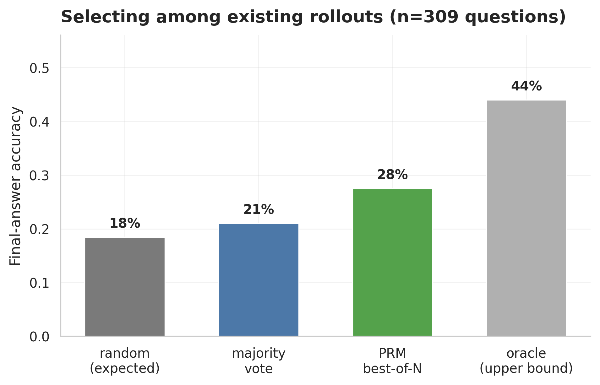

# Experiment 008: PRM Best-of-N Verifier

## Question

Every other use of the PRM judge in this project is offline: it only shapes SFT/DPO/KTO training data. Does the judge's step-level score also work as a *verifier* — picking the best of several already-generated rollouts — better than picking one at random or taking a majority vote?

## Data

- 381 questions have at least one judged rollout.
- 309 questions have >=2 judged rollouts (needed for best-of-N to mean anything); those are what this report scores.
- Mean candidates per eligible question: 3.83 (max 5, since generation used 5 rollouts/question).
- No new generation or judge calls: this reuses `experiments/001_500_reasoning/data/{001_500_reasoning_cleaned,evaluated_rollouts}.jsonl`.

## Selection strategies

| Strategy | Rule |
| --- | --- |
| Random | Expected accuracy of picking one candidate uniformly at random (mean correctness across all candidates for the question) |
| Majority vote | Most common final answer across candidates wins (self-consistency) |
| PRM best-of-N | Candidate with the highest mean step-pass rate wins |
| Oracle | Upper bound: 1 if *any* candidate for the question is correct |

## Results

| Strategy | Accuracy |
| --- | ---: |
| Random (expected) | 18.4% |
| Majority vote | 21.0% |
| **PRM best-of-N** | **27.5%** |
| Oracle (upper bound) | 44.0% |

PRM accuracy restricted to questions where a correct candidate exists among the pool: **62.5%** (this is the judge's precision as a verifier when there is something correct to find).

## Reading

- **The PRM judge is a genuinely useful verifier, not just a training-data labeler.** Best-of-N selection by process score (27.5%) beats both picking a rollout at random (18.4%, +9.1 pp) and majority vote over final answers (21.0%, +6.5 pp). This is the first result in the repo that uses the judge at inference time rather than to build a fine-tuning set, and it works.
- **PRM beats self-consistency.** Majority voting is the standard training-free baseline for this kind of problem (no judge needed, just generate N times and vote) — the judge-guided pick still beats it by 6.5 points, so the step-level scores are adding information that "which answer do most rollouts agree on" doesn't have.
- **There is real headroom left.** Oracle accuracy is 44.0% — meaning a *correct* rollout already exists among the generated candidates for 44% of questions, nearly 2.5x today's single-generation base rate (~18%). The PRM only converts 62.5% of those "a correct answer is in there somewhere" cases into an actual correct pick. That 62.5% number is a direct, quantified measure of judge quality, separate from generation quality — and it is the natural thing to improve next (better judge prompting, a stronger judge model, or a dedicated step-level scorer instead of an LLM-as-judge call).
- **Practical implication for the alignment methods in the main README:** generating 4 rollouts and PRM-selecting among them (27.5%) already beats every single-shot trained system in the six-way holdout table (best is Full DPO at 29%, but that used exactly 1 generation; here it's closer with 4x the inference cost and zero training). Best-of-N and preference training are not competing approaches — they are addressing different parts of the same gap, and a natural follow-up is combining them (PRM-select among rollouts from the DPO-trained model, not just the base model).
