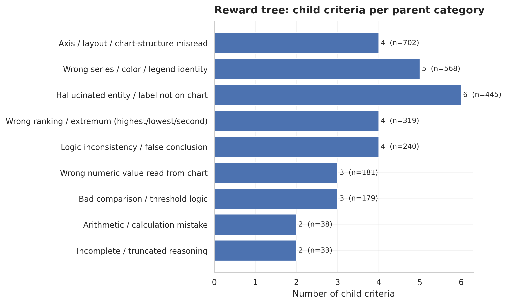

# Experiment 009: Reward Tree (DG-PRM Phase 1, v0)

Adapts the reward-tree component of Yin et al., "Dynamic and Generalizable Process Reward Modeling" (DG-PRM) to ChartPRM.

## What this is (and isn't)

- **Parents**: the 9 human-validated error categories from `scripts/evaluation/categorize_judge_errors.py`'s regex taxonomy over 2,920 real judge failure explanations. DG-PRM discovers parents from scratch; ChartPRM already had them, so they're reused as-is (`other_unspecified` excluded — it's a catch-all, not a criterion).
- **Children**: embedding sub-clusters within each parent (KMeans on the existing MiniLM `fail_analysis_embeddings.npy`, `k` scaled to category size via `choose_child_count`), described by TF-IDF top terms and 2 exemplar judge sentences, then deduplicated by merging near-identical sub-clusters (cosine distance <= 0.14, DG-PRM's `xi`, locally tuned rather than copied from the paper — see sweep below).
- **This is v0.** Child criteria are cluster descriptions, not the clean, reusable rubric statements ('axis values must be read from the correct gridline', etc.) DG-PRM's Phase 1 gets from an LLM judge examining contrastive pairs. That LLM-distillation pass is next, gated on getting a working (Gemini) judge API key — it's a text-only pass over these same clusters, no new rollout generation needed.
- **No new judge/API calls were made for this step.** Everything here is recomputed from data already in the repo (`fail_analyses_categorized.csv` + `fail_analysis_embeddings.npy`).

## Tree stats

- Parents: **9**
- Total child criteria: **33**
- Merge threshold (xi): 0.14
- Retrieval threshold (zeta, for Phase 2): 0.2
- Embedding model: all-MiniLM-L6-v2

## Merge threshold: local sweep (why xi=0.14, not the paper's 0.25)

DG-PRM's published default is xi=0.25, tuned on their own domain/embedding model. Their own ablation (Figure 10a) shows performance is sensitive to this constant, so it was swept locally rather than copied over. Sweeping `--merge-threshold` on this tree (`choose_child_count` and every parent's members held fixed):

| xi | Children | Avg dominance | Worst case |
| ---: | ---: | ---: | --- |
| 0.10 - 0.12 | 37 (no merging below here) | 38% | Incomplete/truncated 61% |
| **0.14** | **33** | **44%** | **Incomplete/truncated 61%** |
| 0.16 | 30 | 51% | Wrong numeric 67% |
| 0.18 | 27 | 57% | Bad comparison 83% |
| 0.20 | 26 | 61% | Wrong numeric 100% |
| 0.22 | 21 | 73% | Wrong numeric 100% |
| 0.25 (paper default) | 17 | 79% | Arithmetic 100% |

0.14 is the first threshold that does any real deduplication (37 to 33: four genuine near-duplicate child pairs folded together) without moving the worst-case category at all — "Incomplete/truncated" sits at 61% dominance at both 0.10 and 0.14, so that collapse is inherent to that category's data, not an artifact of raising the threshold. Past 0.16 the worst case climbs quickly toward total collapse (a single child absorbing 100% of the category). This run:

- Children: **33**
- Average dominance: **44%**
- Worst case: **Incomplete / truncated reasoning** at 61%

## Children per parent

| Parent | Source failures | Children | Largest child share |
| --- | ---: | ---: | ---: |
| Axis / layout / chart-structure misread | 702 | 4 | 36% |
| Wrong series / color / legend identity | 568 | 5 | 48% |
| Hallucinated entity / label not on chart | 445 | 6 | 31% |
| Wrong ranking / extremum (highest/lowest/second) | 319 | 4 | 55% |
| Logic inconsistency / false conclusion | 240 | 4 | 33% |
| Wrong numeric value read from chart | 181 | 3 | 34% |
| Bad comparison / threshold logic | 179 | 3 | 44% |
| Arithmetic / calculation mistake | 38 | 2 | 58% |
| Incomplete / truncated reasoning | 33 | 2 | 61% |

## Full tree

See [`data/reward_tree.json`](data/reward_tree.json).
