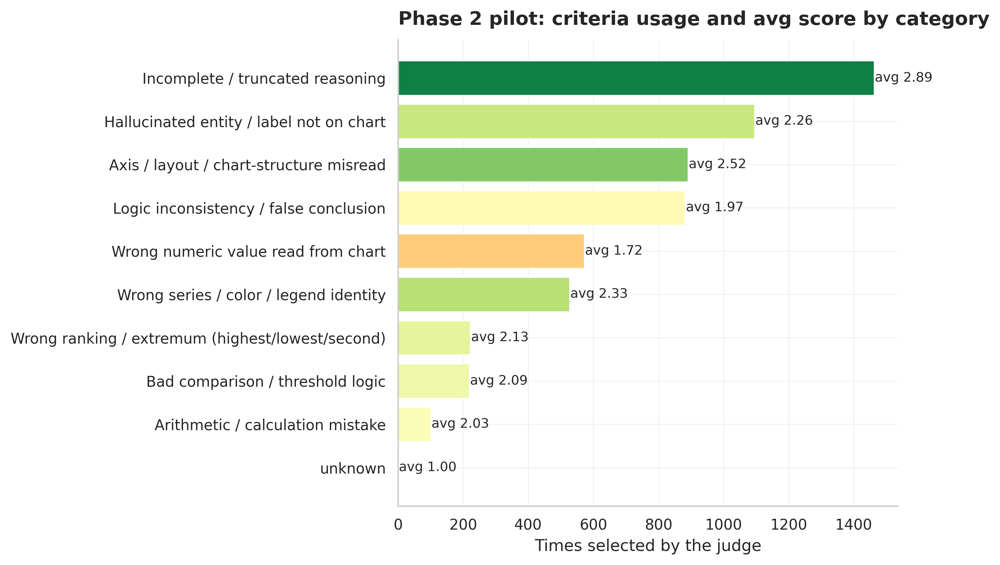

# Experiment 010: Dynamic Multi-Criteria Scoring Pilot (DG-PRM Phase 2)

## What this is

For each rollout of 100 training-pool questions (frozen in `data/pilot_question_ids.json`, disjoint from the protected holdout), a Gemini judge (`gemini-3.5-flash-lite`, free tier) is shown the full 33-criterion reward tree from experiment 009 once, and for every step self-selects which criteria apply and scores them 1-3 -- blind to the ground-truth answer (`chart_prm.dynamic_scoring.build_dynamic_scoring_prompt`). This replaces the original judge's single binary pass/fail-with-ground-truth per step.

- Rollouts scored: **403**
- Questions covered: **100 / 100** pilot questions
- Steps scored: **1562**

## v0 to v1: did the two fixes actually help?

Two changes were made after the first pilot run flagged problems: (1) `experiments/009_reward_tree` was upgraded from TF-IDF-term descriptions to LLM-distilled rubric statements (`distill_reward_tree_criteria.py`), and (2) the scoring prompt was rewritten to force a separate "topic check" pass before the "verdict" pass, since selection and scoring were previously conflated. The original v0 run is preserved at `data/dynamic_scores_v1_conflated.jsonl` for comparison.

| | v0 (conflated prompt, TF-IDF criteria) | v1 (decoupled prompt, distilled criteria) |
| --- | ---: | ---: |
| Score 1 (fail) | 62.4% | **30.4%** |
| Score 2 (ambiguous) | 7.5% | 4.4% |
| Score 3 (pass) | 30.1% | **65.3%** |
| Avg criteria selected / step | 1.12 | **3.82** |
| Steps with 0 criteria selected | 4.2% | 0.0% |

**The fail rate moved a lot, in the direction the diagnosis predicted.** Pass rate (65.3%) now lands close to the original judge's ~41% *step*-pass rate is not directly comparable in scale, but 65.3% is at least in the same neighborhood as "most steps are fine, a substantial minority aren't" rather than v0's "most flagged things are failures," which is the qualitative shift the fix was meant to produce.

**New trade-off worth flagging, not hiding:** criteria selected per step more than tripled (1.12 to 3.82) and zero-criteria steps disappeared entirely (4.2% to 0.0%). That could mean the topic-check pass is working as intended (a step genuinely often touches several categories at once -- reading a value involves both axis-reading and series-identification, say), or it could mean the judge is now over-including rather than under-including. This pilot doesn't distinguish those two explanations; a small human spot-check (improvement point #4 from the earlier discussion, still not done) would. Also: `34/33` distinct criteria were used across the run -- one row referenced a criterion ID not in the tree (the judge invented one), a single occurrence out of 1562 steps but worth noting as a minor parsing/validation gap (`parse_dynamic_scores` doesn't currently check `criterion_id` against the tree).

## Does the fix actually help pick better answers? (`best_of_n_dynamic.py`)

Score calibration improving is not the same question as "does this rank rollouts better." Reran experiment 008's exact best-of-N methodology with the v1 dynamic score in place of the old binary process score, on the same 100 pilot questions for both (008's headline 27.5% was measured on the full 309-question pool, so it isn't directly comparable — recomputed the old method on just these 100 too):

| | Old (v0 binary, this 100-q subset) | New (v1 dynamic) |
| --- | ---: | ---: |
| PRM best-of-N accuracy | 21.0% | 22.0% |
| PRM accuracy \| oracle positive | 53.8%\* | 56.4% |
| Oracle (upper bound) | 40.0% | 39.0%\*\* |

\*Recomputed here restricted to questions where both methods agree a correct candidate exists (n=39), slightly different from the raw 52.5% printed by the script (n=40, old-only oracle-positive set) — done this way so the paired comparison below is on identical question sets.
\*\*The 1-point oracle gap (40 vs 39) isn't a scoring-method effect — oracle only depends on which candidates exist and are correct, not on process_score — it's a couple of rollouts present in one file but dropped as null-response in the other.

**Bootstrapped both differences (10,000 resamples, paired by question) and neither excludes zero:**
- Best-of-N accuracy: +1.0pp, 95% CI [-7.0%, +8.0%]
- Accuracy given oracle-positive: +2.6pp (n=39), 95% CI [-15.4%, +20.5%]

**Honest conclusion:** both fixes produced a large, clearly real improvement in score *calibration* (the 62%→30% fail-rate shift, backed by 1,500+ data points, is not noise). Whether they improved *selection accuracy* specifically is genuinely unresolved at this sample size — the point estimates moved the right direction on both metrics, but 100 questions isn't enough to tell a +1-3pp shift from chance. Scaling the pilot to more of the 384-question training pool (same free-tier pipeline, just a longer run) is the direct way to get a CI tight enough to answer this properly, rather than reading more into these numbers than they support.

## Criteria selection

- Average criteria selected per step: **3.82** (out of 33 available) -- selective, not indiscriminate.
- Steps with zero criteria selected (judge found nothing relevant): **0 (0.0%)**
- Distinct criteria actually used at least once: **34 / 33**

## Score distribution (1=exhibits failure, 2=ambiguous, 3=does not exhibit)

| Score | Count | Share |
| --- | ---: | ---: |
| 1 (fail) | 1815 | 30.4% |
| 2 (ambiguous) | 260 | 4.4% |
| 3 (pass) | 3899 | 65.3% |

## Most and least used criteria

| Criterion | Parent | Times used | Avg score |
| --- | --- | ---: | ---: |
| `incomplete_or_truncated_step_1` | Incomplete / truncated reasoning | 874 | 2.88 |
| `logic_inconsistency_0` | Logic inconsistency / false conclusion | 692 | 1.96 |
| `incomplete_or_truncated_step_0` | Incomplete / truncated reasoning | 589 | 2.90 |
| `hallucinated_entity_0` | Hallucinated entity / label not on chart | 524 | 2.44 |
| `axis_or_layout_misread_0` | Axis / layout / chart-structure misread | 487 | 2.65 |
| `wrong_series_or_color_1` | Wrong series / color / legend identity | 427 | 2.39 |
| `wrong_numeric_read_0` | Wrong numeric value read from chart | 297 | 1.67 |
| `wrong_numeric_read_2` | Wrong numeric value read from chart | 267 | 1.76 |
| `axis_or_layout_misread_5` | Axis / layout / chart-structure misread | 198 | 2.53 |
| `hallucinated_entity_5` | Hallucinated entity / label not on chart | 179 | 2.17 |

## Usage by parent category

| Parent | Total selections |
| --- | ---: |
| Incomplete / truncated reasoning | 1463 |
| Hallucinated entity / label not on chart | 1096 |
| Axis / layout / chart-structure misread | 891 |
| Logic inconsistency / false conclusion | 882 |
| Wrong numeric value read from chart | 572 |
| Wrong series / color / legend identity | 527 |
| Wrong ranking / extremum (highest/lowest/second) | 222 |
| Bad comparison / threshold logic | 219 |
| Arithmetic / calculation mistake | 101 |
| unknown | 1 |

