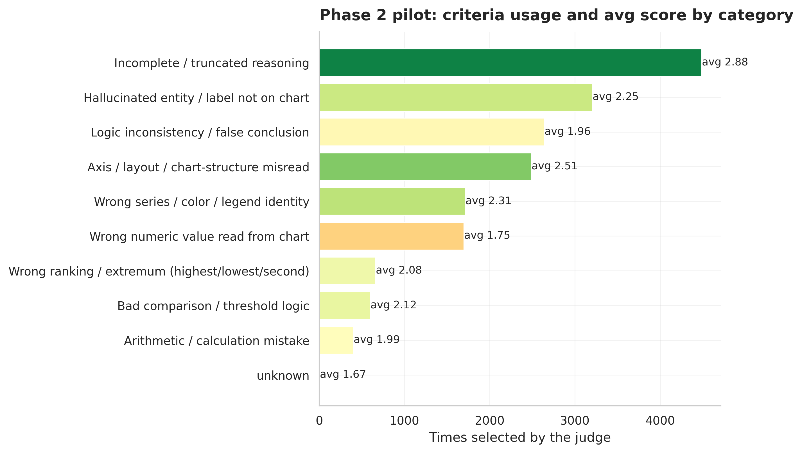

# Experiment 011: Dynamic Multi-Criteria Scoring at Full Scale (309 questions)

## What this is

For each rollout of 309 training-pool questions (frozen in `full_question_ids.json`, disjoint from the protected holdout), a Gemini judge (`gemini-3.5-flash-lite`, free tier) is shown the full 33-criterion reward tree from experiment 009 once, and for every step self-selects which criteria apply and scores them 1-3 -- blind to the ground-truth answer (`chart_prm.dynamic_scoring.build_dynamic_scoring_prompt`). This replaces the original judge's single binary pass/fail-with-ground-truth per step.

- Rollouts scored: **1199**
- Questions covered: **309 / 309** pilot questions
- Steps scored: **4652**

## Criteria selection

- Average criteria selected per step: **3.85** (out of 33 available) -- selective, not indiscriminate.
- Steps with zero criteria selected (judge found nothing relevant): **0 (0.0%)**
- Distinct criteria actually used at least once: **38 / 33**

## Score distribution (1=exhibits failure, 2=ambiguous, 3=does not exhibit)

| Score | Count | Share |
| --- | ---: | ---: |
| 1 (fail) | 5406 | 30.2% |
| 2 (ambiguous) | 930 | 5.2% |
| 3 (pass) | 11564 | 64.6% |

## Most and least used criteria

| Criterion | Parent | Times used | Avg score |
| --- | --- | ---: | ---: |
| `incomplete_or_truncated_step_1` | Incomplete / truncated reasoning | 2601 | 2.87 |
| `logic_inconsistency_0` | Logic inconsistency / false conclusion | 2079 | 1.96 |
| `incomplete_or_truncated_step_0` | Incomplete / truncated reasoning | 1885 | 2.91 |
| `hallucinated_entity_0` | Hallucinated entity / label not on chart | 1560 | 2.41 |
| `wrong_series_or_color_1` | Wrong series / color / legend identity | 1413 | 2.37 |
| `axis_or_layout_misread_0` | Axis / layout / chart-structure misread | 1378 | 2.65 |
| `wrong_numeric_read_0` | Wrong numeric value read from chart | 938 | 1.65 |
| `wrong_numeric_read_2` | Wrong numeric value read from chart | 732 | 1.87 |
| `hallucinated_entity_5` | Hallucinated entity / label not on chart | 534 | 2.16 |
| `axis_or_layout_misread_5` | Axis / layout / chart-structure misread | 528 | 2.54 |

## Usage by parent category

| Parent | Total selections |
| --- | ---: |
| Incomplete / truncated reasoning | 4486 |
| Hallucinated entity / label not on chart | 3206 |
| Logic inconsistency / false conclusion | 2641 |
| Axis / layout / chart-structure misread | 2489 |
| Wrong series / color / legend identity | 1713 |
| Wrong numeric value read from chart | 1696 |
| Wrong ranking / extremum (highest/lowest/second) | 661 |
| Bad comparison / threshold logic | 601 |
| Arithmetic / calculation mistake | 401 |
| unknown | 6 |

## Calibration holds up at scale

Fail rate: 30.2% (309 questions, 4,652 steps) vs. 30.4% on the 100-question pilot. Pass rate: 64.6% vs. 65.3%. Essentially identical — the conflation-bug fix (experiment 010's v0-to-v1 change) produced a stable, reproducible shift, not a fluke of the smaller sample.

## The actual payoff question, now with real statistical power

Reran `best_of_n_dynamic.py` on all 309 eligible questions (not the 100-question subset), same methodology as experiment 010:

| | Old (v0 binary judge) | New (v1 dynamic judge) |
| --- | ---: | ---: |
| PRM best-of-N accuracy | **27.5%** | 24.9% |
| PRM accuracy \| oracle positive (n=136) | 62.5% | 56.6% |
| Oracle (upper bound) | 44.0% | 44.0% |

The old-judge number (27.5%) exactly matches experiment 008's original headline result on the full 309-question pool -- a direct sanity check that this comparison is built correctly, not an artifact of the re-implementation.

**This reverses the pilot's direction.** At 100 questions the point estimate favored the new judge (+1.0pp); at the full 309 it favors the old one (-2.6pp). Bootstrapped both (10,000 paired resamples):

- Best-of-N accuracy: **-2.6pp, 95% CI [-6.5%, +1.3%]** -- still crosses zero.
- Accuracy given oracle-positive: **-5.9pp (n=136), 95% CI [-14.7%, +2.9%]** -- still crosses zero.

**Honest verdict: still not statistically significant even at full power, but the sign flip matters.** At n=100 the story was "inconclusive, maybe a small real gain." At n=309 it's "inconclusive, point estimate now leans the other way." Neither claims a proven effect in either direction -- that's the correct, if unsatisfying, final answer to "did scaling up settle this."

## Most likely explanation for the negative lean

The comparison is not actually fair to the new judge, and it's worth saying exactly how. **The old judge is shown the ground-truth answer when it grades each step** (`evaluate_rollouts_meta.py`'s prompt includes `Ground Truth Answer: {GROUND_TRUTH}`); **the new judge deliberately is not** (`dynamic_scoring.py`'s prompt has no answer-key parameter at all -- a design choice made explicitly to test genuine blind verification, not a bug). On a task literally defined as "figure out which rollout reached the correct answer," a judge that has already been told the correct answer has a structural advantage no amount of criteria-tree sophistication can fully offset. Framed that way, a blind judge landing within noise of an answer-informed one -- not *significantly* worse, on a strictly harder task -- is a more informative result than the raw -2.6pp suggests, even though it does not demonstrate the new judge is better.

This is the leading hypothesis, not a proven one -- disentangling it from other candidate explanations (over-selection dilution: avg criteria/step is 3.85, up from the old judge's implicit 1-per-step; the `dynamic_process_score` aggregation choice; `gemini-3.5-flash-lite` being the cheapest vision-capable tier) would need a same-judge, ground-truth-shown ablation, which hasn't been run.

## Where this leaves the DG-PRM adaptation overall

- **Phase 1 (reward tree) and its criteria are real, reusable artifacts** -- 33 distilled rubric statements, tuned merge threshold, documented and tested.
- **Phase 2 (dynamic scoring) produces a well-calibrated, blind, multi-dimensional judge** -- a genuine capability the project didn't have before, independent of whether it wins a best-of-N horse race against an answer-informed baseline.
- **It does not demonstrate an improvement in rollout-selection accuracy over the original judge**, at either sample size tested. That is a legitimate negative result worth reporting as-is, not something to keep re-running until it looks better.
- **Phase 3 (Pareto-filtered DPO pairs) remains unbuilt** and, given this result, its case is weaker than it looked after the 100-question pilot -- there's currently no evidence the new scores would produce better training pairs than the ones already used for experiment 008's 29% Instruct-to-DPO run.
